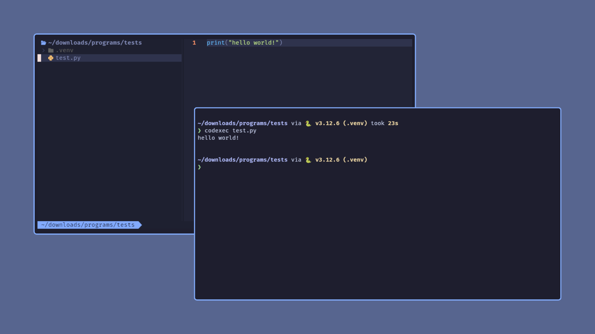

As developers, we often deal with multiple programming languages, each with its own setup and execution process. Managing all these environments can be tedious, especially when switching between projects. Wouldn't it be great to have a single tool that compiles and runs your code, regardless of the language, from the comfort of your terminal?

That’s where **CodExec** comes in—a Python package designed to compile and execute code written in multiple programming languages by making API calls to a remote server. With CodExec, you can quickly run code in C, C++, Java, Python, and JavaScript without worrying about setting up compilers or runtime environments for each language.

## What is CodExec?

**CodExec** is a command-line interface (CLI) tool that makes executing code files effortless. Whether you're writing in C, C++, Java, Python, or JavaScript, CodExec can handle it all. Simply point it to your code file, and CodExec will take care of the rest by using an external API to compile and run the code.

Imagine working on a project where you have snippets of code in different languages. CodExec allows you to execute all of them from a single interface. It's lightweight, easy to use, and helps avoid the clutter of managing multiple development environments.

### Features of CodExec

CodExec comes packed with features that make it useful for both beginners and experienced developers:

- **Support for Multiple Languages**: Run code written in C, C++, Java, Python, and JavaScript from a single tool.
- **Command-Line Interface (CLI)**: A simple and intuitive CLI to execute code files.
- **Input File Support**: Pass input files for code that requires additional data during execution.
- **Fast and Reliable**: CodExec makes API calls to execute the code remotely, ensuring that you don't need to install compilers or interpreters locally.

## Getting Started with CodExec

Getting started with CodExec is easy. You can install it directly from PyPI, the Python Package Index, and start using it immediately from your terminal.

### Step 1: Installation

To install CodExec, simply use `pip`:

```bash
pip install codexec
```

Once installed, you can verify that CodExec is working by running the `codexec` command in your terminal.

### Step 2: Basic Usage

Using CodExec is straightforward. To run a code file, just provide the path to the file:

```bash
codexec path/to/your/code.py
```

CodExec will automatically detect the language based on the file extension and execute the code.

### Step 3: Handling Input Files

If your code requires input, you can pass an input file using the `--input-path` option:

```bash
codexec path/to/your/code.cpp -i path/to/input.txt
```

CodExec will pass the content of the input file to your code during execution, allowing you to handle input-driven programs seamlessly.

### Supported Languages

CodExec currently supports the following languages:
- **C** (.c)
- **C++** (.cpp)
- **Java** (.java)
- **Python** (.py)
- **JavaScript** (.js)

You don't need to worry about setting up different environments for these languages. CodExec will detect the file type based on the extension and handle the rest.

### Full Example

Here’s a complete example of how you can run a Python script with an input file:

```bash
codexec script.py -i input.txt
```

CodExec will read both the Python file and the input file, execute the script, and return the output directly in your terminal.

## CodExec on PyPI

CodExec is now available on PyPI, the official Python Package Index. This means that you can easily install it using `pip` and get all future updates as they become available.

To install CodExec, simply run:

```bash
pip install codexec
```

Once installed, you're ready to run code across multiple languages without needing to install and configure separate compilers or interpreters.

## Conclusion

Whether you're a student, developer, or just someone experimenting with different programming languages, CodExec makes executing code simple and efficient. It removes the hassle of setting up multiple environments, allowing you to focus on what matters—writing and running code.

Give CodExec a try today, and simplify your coding workflow with this powerful command-line tool! If you run into any issues or have suggestions, feel free to contribute or open an issue on the CodExec GitHub repository.