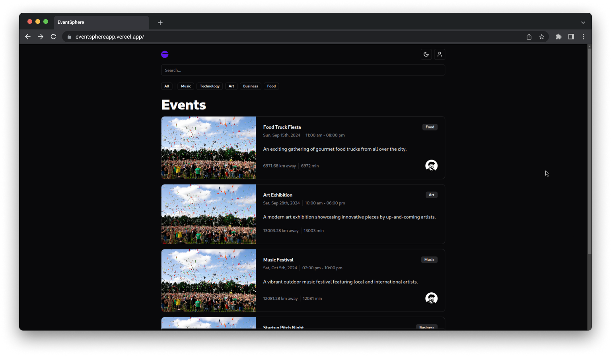

In today’s fast-paced world, keeping track of social gatherings, meetups, and events can be overwhelming. As someone who loves attending events and meeting new people, I wanted to create a solution that would make discovering and connecting with local events easy and fun. That’s how **EventSphere** was born.

## **What is EventSphere?**

**EventSphere** is a location-based event discovery app that allows users to find nearby events, join them, and connect with fellow attendees in real-time. The app is built with simplicity in mind, offering a streamlined experience for people looking to explore events happening in their city or even in other areas.

### **Key Features of EventSphere**

- **Location-Based Event Listings**: EventSphere shows a curated list of nearby events based on your current location or a manually entered city. It ensures that you stay updated with what’s happening around you.
- **Filter Events by Categories**: Users can filter events by various categories such as music, tech, food, and more. This feature helps you narrow down events that interest you the most.

- **Find Nearest and Latest Events**: The app prioritizes the nearest and most recent events at the top, ensuring users don't miss out on the most relevant opportunities.

- **Event Details**: Each event has its own details page that provides users with important information like venue, date, time, and description.

- **Join Events & Real-Time Chatroom**: When users join an event, they gain access to a chatroom where they can communicate with other attendees in real time. This fosters community engagement and interaction among participants.

- **Bookmarking**: Users can bookmark events they’re interested in for easy access later, making it convenient to plan your schedule.

## **Building EventSphere**

The development process for **EventSphere** involved several technologies that allowed me to achieve a smooth and scalable experience:

- **Frontend**: The app’s frontend was built using React, ensuring a clean and responsive user interface.
- **Backend & Authentication**: I used **Convex** to handle backend functionalities such as user authentication, event management, and real-time chat features. Convex’s **Single Sign-On (SSO)** made the authentication flow extremely easy to set up and integrate.

- **Map Integration**: One of the core features of the app is displaying events on a map. This was a new challenge for me, but integrating the map feature helped enhance the user experience, allowing them to visualize the events geographically.

- **TypeScript**: I utilized TypeScript throughout the project, which improved the code's quality and ensured better error handling.

## **Challenges I Faced**

Like any project, **EventSphere** came with its own set of challenges. Some of the key challenges included:

- **Channeling Data**: Since the app receives events from external sources, generating dummy data for testing purposes proved to be a challenge. I had to create realistic test cases to ensure that the app handled event data efficiently.

- **Map Integration**: Working with map APIs was a new experience, and it took some time to figure out how to display events on the map accurately.

- **Fluency with TypeScript**: Although I had experience with TypeScript, this project allowed me to become much more fluent with it, especially when it came to defining types and managing complex data flows.

## **What I Learned**

Building **EventSphere** was a rewarding learning experience. Here’s what I took away from the project:

- **Convex Mastery**: I became proficient with Convex’s powerful authentication and backend tools. The SSO feature was particularly impressive, and it allowed me to simplify the authentication flow for users.

- **Improved TypeScript Skills**: Working with TypeScript throughout the project helped me become more fluent in it, making me more confident in handling large-scale codebases with static types.

- **Tackling Map APIs**: Integrating maps into the app was a steep learning curve, but it taught me how to leverage APIs to create interactive and dynamic user interfaces.

## **What’s Next for EventSphere?**

Although **EventSphere** is complete, there are plenty of features I’m excited to explore in future versions. Some ideas I’d like to incorporate include:

- **Enhanced Search and Filtering**: Adding more filters and advanced search options to improve event discovery.
- **AI-Generated Event Descriptions**: Utilizing AI to automatically generate concise and engaging event descriptions.

- **Additional Real-Time Features**: Expanding the chat functionality and adding more real-time interactions between users.

## **Conclusion**

**EventSphere** was not only a passion project but also a way for me to enhance my development skills and learn new technologies. It’s been incredibly rewarding to see the app come to life, from conceptualization to deployment.

Whether you’re looking for social gatherings, workshops, or concerts, **EventSphere** has got you covered. Try it out and explore what’s happening around you!

