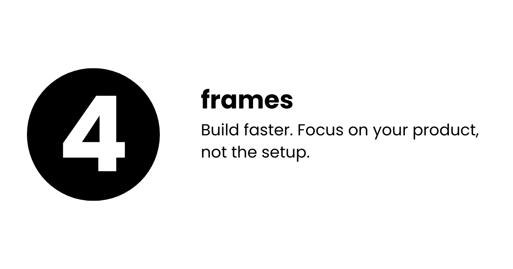
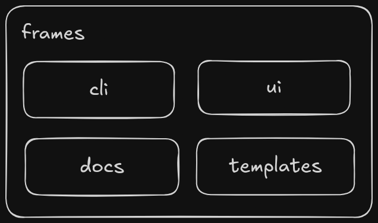

Are you tired of wasting time on setup instead of building your product? **Frames** is here to change that. With our ready-to-use templates, you can focus on creating something amazing instead of wrestling with initial configurations.

### Why Choose Frames?

- **Versatile Templates**: Whether you're building frontend, backend, libraries, or packages, we've got you covered.
- **Pre-Integrated Utilities**: Custom CSS with Tailwind and essential tools are already built-in.
- **One Command Setup**: Clone and set up your project effortlessly.

## Get Started

Skip the hassle. Get your project running with just one command:

```bash
npm create @pr4j3sh/frames@latest <template_name> myproject
```

## **Frames Components**



#### CLI

Simplify project setup with a single command.  
[NPM Package](https://www.npmjs.com/package/@pr4j3sh/create-frame)

#### UI

Custom CSS built with Tailwind, ready for all your templates.  
[Explore UI](https://pr4j3sh.github.io/ui/)

#### Docs

Access detailed usage instructions and guides.  
[Explore Docs](https://pr4j3sh.github.io/frames/)

#### Templates

Choose from a variety of pre-configured templates to kickstart your projects.  
[Browse Templates](https://pr4j3sh.github.io/frames/templates)

With Frames, building great projects has never been easier.
