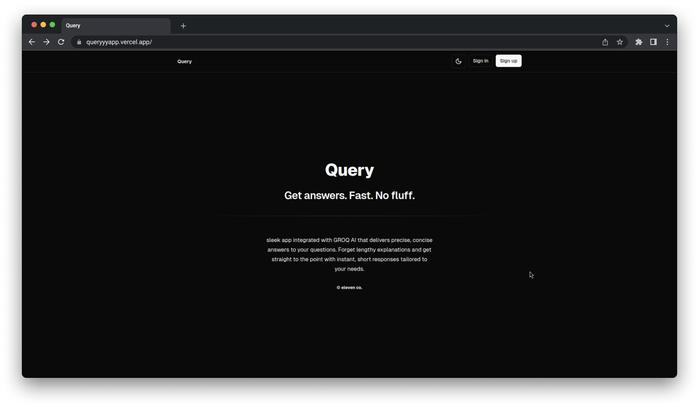

In the digital age, where information is vast and often overwhelming, students face a major challenge: finding answers that are precise and relevant. We’ve all been there—asking a question, only to be bombarded with lengthy, off-track explanations that take us far from our original intent. This is where **Query App** steps in, providing a simple yet powerful solution to this problem.

## The Problem: Information Overload in the Age of Learning

As students, whether in school, college, or self-learning environments, we constantly seek answers to questions that help us grow academically or solve problems. However, most available sources tend to dive deep, offering long, detailed responses that often lead us astray from the initial query.

The result? **Confusion and wasted time.**

Long-winded answers can cause:

- **Distraction**: Leading students into irrelevant details.
- **Time Drain**: Making students sift through unnecessary information.
- **Frustration**: Especially when immediate, direct answers are needed.

## The Solution: Query App

**Query App** solves this by delivering short, crisp answers tailored to exactly what you’re asking, ensuring students stay on track without the burden of excessive information. By integrating with **GROQ's llama3-8b-8192** model, the app quickly processes your query and delivers concise answers in real-time.

### How It Works

1. **Ask**: Students submit a query, much like they would in a typical search.
2. **AI Processing**: The app communicates with the GROQ API to process the question.
3. **Get Crisp Answers**: The app provides a direct, no-nonsense response to your question, saving you time and keeping you focused.

## Why We’re Building This

Students often lose hours trying to extract relevant data from verbose explanations. Instead of learning the key points, they spiral into unrelated topics, delaying progress and adding frustration to the learning process.

At **Query App**, we understand that students need **quick**, **to-the-point** responses, especially when under pressure. Whether preparing for exams, completing assignments, or building projects, students benefit from having a tool that respects their time and helps them **stay focused** on their goals.

## How We Solve These Problems

- **Short Answers, No Fluff**: We strip down the noise and provide what’s needed. Every query gets a direct answer, eliminating unnecessary distractions.
- **Built for Students**: We know the pain points students face. Whether studying for a test or completing an assignment, our app provides answers that keep them moving forward.
- **Easy to Use**: The user-friendly interface allows you to ask questions quickly, whether you're on your PC, mobile, or tablet.

## Key Features

- **Real-Time AI Responses**: Powered by GROQ's llama3-8b-8192 model for fast, accurate results.
- **History Tracking**: Students can review past queries to stay organized.
- **Supabase-Integrated Data**: All queries and responses are stored securely, giving users access to their learning history.

## Who Is It For?

- **Students**: Looking for quick, clear answers to academic questions.
- **Educators**: Who want to offer students a resource for focused learning.
- **Self-Learners**: Pursuing knowledge without getting bogged down by long-form content.

## Conclusion

In a world of increasing information overload, **Query App** empowers students by giving them the answers they need—fast. No more getting lost in the details. No more distractions. Just short, accurate, and actionable answers. So, the next time you're in doubt, simply **"Just Query it with Query!"**
