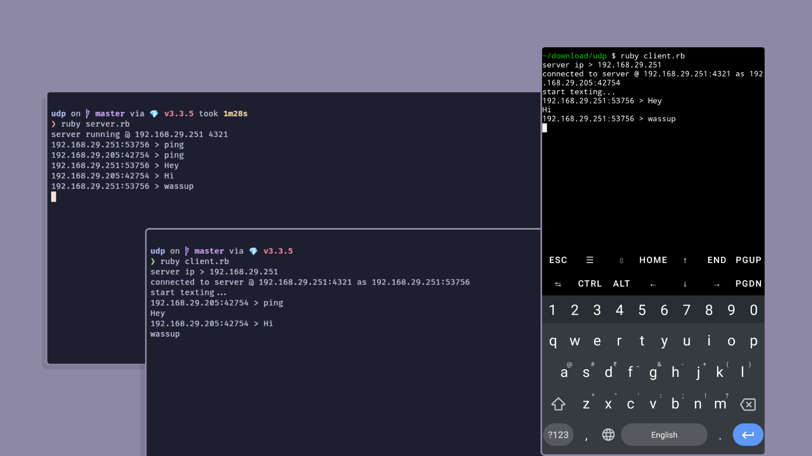

In this blog, we will explore the creation of a simple chat application using the User Datagram Protocol (UDP) in Ruby. This project highlights the lightweight nature of UDP, which is ideal for applications that require speed and efficiency.

## What is UDP?

The User Datagram Protocol (UDP) is one of the core protocols of the Internet Protocol (IP) suite. Unlike its counterpart, Transmission Control Protocol (TCP), UDP is a connectionless protocol that allows for the transmission of messages (datagrams) without establishing a connection. This makes UDP faster but less reliable since there is no guarantee that messages will be delivered in order or at all.

### Key Features of UDP:

- **Connectionless**: No need to establish a connection before sending data.
- **Unreliable**: Messages may be lost, duplicated, or arrive out of order.
- **Lightweight**: Minimal overhead compared to TCP, leading to faster communication.

Here’s a simplified ASCII diagram to visualize the UDP communication model:

```
+-----------------+                     +-----------------+
|     Client      |                     |     Server      |
+-----------------+                     +-----------------+
| 1. Send Message +-------------------->|                 |
|                 |                     | 2. Receive Msg  |
|                 |                     |                 |
|                 |<--------------------| 3. Send Reply   |
| 4. Receive Reply|                     |                 |
+-----------------+                     +-----------------+
```

## Project Overview

In this project, we will create a UDP chat application consisting of a server and a client. The server will listen for incoming messages and broadcast them to all connected clients, while each client can send messages to the server.

### Installing Ruby

Before running the chat application, ensure you have Ruby installed on your machine. You can download Ruby from the official website: [Ruby](https://www.ruby-lang.org/en/).

### Project Setup

1. **Create the UDP Server**:

   - Create a file named `server.rb` and add the following code:

   ```ruby
   require 'socket'

   BUFFER_SIZE = 1024
   PORT = 4321

   def local_ip
     Socket.ip_address_list.detect(&:ipv4_private?).ip_address
   end

   HOSTNAME = local_ip

   socket = UDPSocket.new
   socket.bind(HOSTNAME,PORT)

   puts "server running @ #{HOSTNAME} #{PORT}"

   clients = []

   loop do
     message, sender = socket.recvfrom(BUFFER_SIZE)
     port = sender[1]
     host = sender[2]
     author = "#{host}:#{port}"
     message = message.strip

     puts "#{author} > #{message}"

     clients << sender unless clients.include?(sender)

     clients.each do |client|
       cport,chost = client[1], client[2]
       socket.send("#{author} > #{message}",0,chost,cport)
     end
   end
   ```

2. **Create the UDP Client**:

   - Create a file named `client.rb` and add the following code:

   ```ruby
   require 'socket'

   BUFFER_SIZE = 1024

   print 'server ip > '
   HOSTNAME = gets.chomp
   PORT = 4321

   def local_ip
     Socket.ip_address_list.detect(&:ipv4_private?).ip_address
   end

   socket = UDPSocket.new
   socket.bind(local_ip, 0)

   assigned_port = socket.addr[1]

   user = "#{local_ip}:#{assigned_port}"

   socket.send('ping',0,HOSTNAME,PORT)
   puts "connected to server @ #{HOSTNAME}:#{PORT} as #{user}"
   puts "start texting..."

   Thread.new do
     loop do
       message, _ = socket.recvfrom(BUFFER_SIZE)
       author, _ = message.strip.split(' > ', 2)
       if author != user
         puts "#{message.strip}"
       end
     end
   end

   loop do
     message = gets.chomp
     socket.send(message,0,HOSTNAME,PORT)
   end
   ```

### Running the Application

1. **Start the Server**:

   - Open a terminal window and run the following command:

   ```bash
   ruby server.rb
   ```

2. **Start the Client**:

   - Open another terminal window and run the following command:

   ```bash
   ruby client.rb
   ```

   You will be prompted to enter the server's IP address. Enter the appropriate address and start chatting!

### Conclusion

This simple UDP chat application demonstrates the basics of using UDP for real-time communication. While UDP is faster and requires less overhead, remember that it does not guarantee message delivery. This project can be expanded upon by adding features such as user authentication, message history, or even a graphical user interface.

Feel free to explore and build upon this foundation for your own applications!

