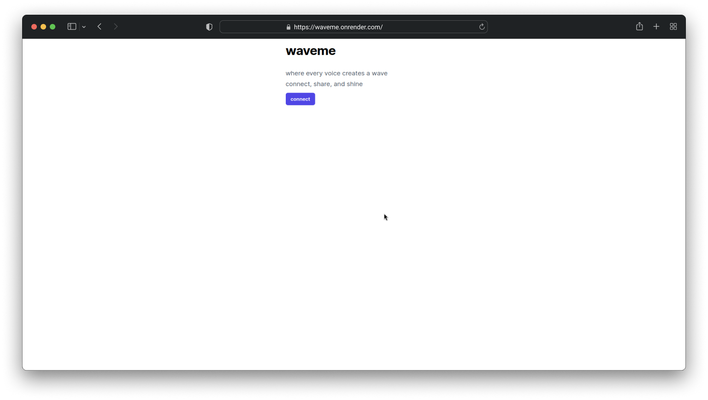

**waveme** is a simple yet powerful social media app designed to facilitate interaction between users through posts, profiles, and personalized feeds. Built using **Ruby on Rails**, **PostgreSQL**, and **TailwindCSS**, the project showcases the core features of a social media platform while leveraging modern web technologies for scalability and ease of development.

### The Stack Behind WaveMe

1. **Ruby on Rails**: The backbone of WaveMe is Ruby on Rails, a popular web framework known for its convention-over-configuration approach and rapid development capabilities. Rails provides a structured way to handle user authentication, database management, and RESTful API design, which makes it a great fit for building social media apps like WaveMe.

2. **PostgreSQL**: As the app's relational database, PostgreSQL manages user data, posts, and other dynamic content. It’s highly scalable and ensures that the app can handle growing amounts of data while maintaining performance and reliability.

3. **TailwindCSS**: TailwindCSS brings a utility-first approach to styling the app’s interface. This framework helps to create a clean, modern, and responsive UI without bloating the app with unnecessary styles. With Tailwind, the user experience remains intuitive and consistent across devices.

### Core Features of WaveMe

- **User Authentication**: Secure authentication is the cornerstone of any social media app. WaveMe allows users to create accounts, log in, and manage their profiles with ease. Once authenticated, users can engage with the platform's features seamlessly.
- **Textual Posts**: Users can share their thoughts and updates in the form of text-based posts. These posts are visible on the feed, allowing others to stay updated with the latest activities.

- **Feed**: The feed is one of WaveMe’s central features, displaying the most recent posts from users in reverse chronological order. The clean, intuitive design ensures that users can easily browse through the latest updates from their network.

- **User Profiles**: Each user has a profile where they can manage their information and view the posts they have shared. The profile page creates a personalized space within the app where users can curate their presence on the platform.

### Deployment on Render

To make WaveMe accessible to the world, it was deployed using **Render**, a cloud platform known for its simplicity and developer-friendly tools. Render provides seamless integration with GitHub and easy-to-manage hosting services, allowing for fast deployments and hassle-free database management.

By utilizing Render’s PostgreSQL database and environment configuration tools, the app was deployed in no time. The deployment process ensures that the app runs smoothly and can scale as more users join the platform.

### Looking Forward

WaveMe is built with core social media functionality in mind, and the potential for future growth is vast. From adding multimedia content, such as images and videos, to implementing interactive features like comments or messaging, WaveMe is ready to evolve with its user base.

Overall, WaveMe highlights the strengths of combining Rails' back-end power with the flexibility of PostgreSQL and the sleek design capabilities of TailwindCSS. It is a foundation for building more complex, feature-rich social media applications.

